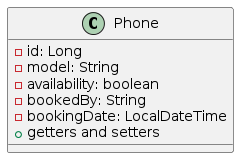
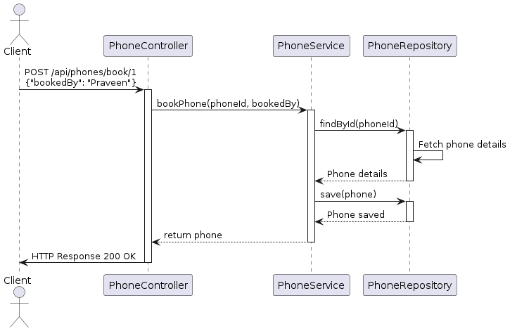

# mobile-testing-app

This README provides essential information for setting up, deploying, and running the application.

## Table of Contents

1. Introduction
2. Prerequisites
3. Clone & Building
4. Configuration
5. Deployment
6. Running the Application
7. API Documentation
8. Contributing
9. License

## Introduction

mobile-testing-app application facilitates the testing engineer to list down all the mobiles and avail option
book and return the mobile device for testing.

## Prerequisites

Before you begin, ensure you have the following installed:

- Java 17
- Maven 3.x

## Clone & Build

1. Clone this repository:

   `git clone https://github.com/praveenbommalibits/mobile-testing-app.git`

2. Navigate to the project directory:

    `cd mobile-testing-app`

3. Build the project:

   `mvn clean install`

## Configuration

1. Configure application properties (if needed) in `application.properties`

## Deployment

1. Deploy the application to Azure or local environment
2. Creation of deploy.yml file deploy application to Azure using github Actions CI/CD pipeline.

## Running the Application

1. Start the application:
    
    `java -jar target/mobile-testing-app*.jar`

2. Access the application at http://localhost:8080.

## API Documentation

- **API Endpoint 1**: GET /api/phones
- Description: Get all phone records.
- Example: `curl http://localhost:8080/api/phones`

- **API Endpoint 2**: POST /api/phones/book/{phoneId}
- Description: Book a phone by providing the `phoneId` and `bookedBy`.
- Example: `curl -X POST "http://localhost:8080/api/phones/book/1?bookedBy=Praveen"`

- **API Endpoint 3**: POST /api/phones/return/{phoneId}
- Description: Return a phone by providing the `phoneId` `.
- Example: `curl -X POST "http://localhost:8080/api/phones/return/1"`

## Diagrams
Class Diagram:

https://www.plantuml.com/plantuml/uml/SyfFKj2rKt3CoKnELR1Io4ZDoSa70000

(https://cdn-0.plantuml.com/plantuml/png/LSun2W9130NGVaxnU_42MorYQI7e1R8xOGrcPc0IXKMykqPjx5v-GlYZENM_5KspaXcEbrOPZmHi8Nd0eTNbCvIMMGUSlCileJk9qYGglWwOMbEc6flmbVDk_JkFyEqzESVRcJHubi89s61XT-u6gXdsTNgcaMkESYy0)

Sequential Diagram:

https://www.plantuml.com/plantuml/uml/SyfFKj2rKt3CoKnELR1Io4ZDoSa70000

(https://cdn-0.plantuml.com/plantuml/png/XL9DIyGm4BttLmmzAIXTFVOWYmlYuc6BswENs8nii4v2CbjOnFzkqwOaMwfxwanv7-ynMJiMbezVRIOQrXOshKBYpFG_LQEC88QyEcZ2ZIQskctHvY0Sn7K1kqVRgGO7O9WNKAzej5EzwMa0nZNBnXHm-v3ub53jzZKKmgZ2UBuhthN-BExUw3lt4yh7KrxsubPqY9J_-4gg4unfsZXw-P2k12ymfBeQjBVo1YRDwwWpbGbVhn1Zb_2XgCTlvQGHcMcxECxvJyZD0GOoI6IXMdU6JWDNPoY9Iqv_n7IY2pN_3xXiwTdoak7iSXRvQ6bibb83VdQKyVebFDTrrQixeyaXtAzMi7j9sP6LhP6aVyI_)

